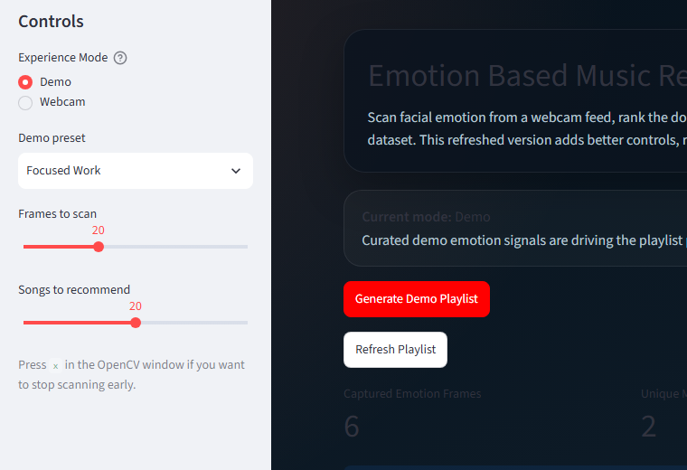
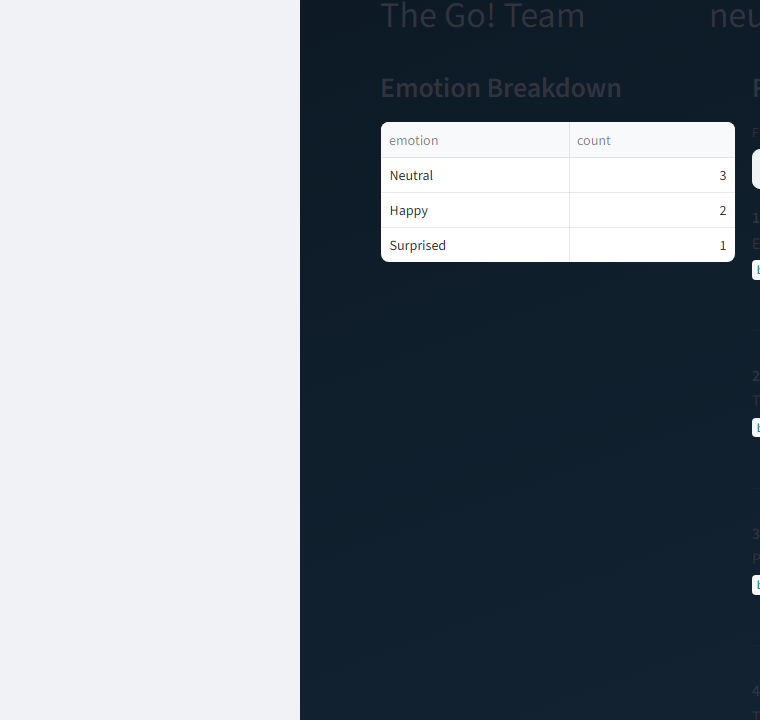

# Emotion Based Music Recommendation System

This repository contains a Streamlit application that scans a user's facial expression through a webcam, predicts dominant emotions with a pretrained CNN model when available, and generates a playlist-style recommendation set from the bundled `muse_v3.csv` dataset. It also now includes a polished demo mode so the full recommendation experience remains usable when the heavy local ML stack is unavailable.

## Stack

- Streamlit
- OpenCV
- TensorFlow / Keras
- pandas
- NumPy

## Features

- Live webcam-based emotion scanning
- Demo mode for local walkthroughs and portfolio screenshots
- Emotion ranking across multiple captured frames
- Mood-bucket normalization for playlist generation
- Score-based ranking inside each mood bucket instead of naive fixed slicing
- Recommendation count controls from the sidebar
- Recommendation export as CSV
- Emotion breakdown summary after each scan
- Playlist refresh without needing another webcam scan
- Bucket-level filtering for the generated playlist
- Playlist insight cards for top artist, dominant mood bucket, and artist diversity

## Run

```powershell
python -m venv .venv
.venv\Scripts\Activate.ps1
pip install -r requirements.txt
streamlit run app.py
```

On Python `3.13`, the conditional dependency marker skips TensorFlow automatically. In that case the app still runs in `Demo` mode.

## Interface Walkthrough

### Controls And Hero View

The app opens into a two-mode experience: `Demo` for local walkthroughs and `Webcam` for live scanning when the TensorFlow stack is available.



### Recommendation Results

After generating a playlist, the app shows emotion counts, playlist insights, and the ranked recommendation list.



## How It Works

1. The app opens a webcam session through OpenCV.
2. A pretrained emotion model predicts facial emotion per detected face frame.
3. The captured emotions are ranked by frequency.
4. The top mood buckets are mapped to ranked candidate lists from the music dataset.
5. A score-based shortlist is assembled with duplicate filtering and displayed in the Streamlit interface.

## Demo Mode

If TensorFlow or the pretrained webcam stack is not available locally, the app can still run in `Demo` mode:

1. Choose a curated mood preset from the sidebar.
2. Generate a playlist without needing webcam input.
3. Review the emotion breakdown, playlist, and playlist insights.
4. Export the recommendation set as CSV.

## Modernization Pass

This version keeps the original idea but updates the experience:

1. removed brittle top-level webcam handling
2. fixed modern pandas compatibility
3. added caching for large resources
4. added sidebar controls for scan depth and playlist size
5. added an emotion-count summary and recommendation export
6. added playlist refresh without a new webcam scan
7. added bucket-level filtering for the generated playlist
8. improved the visual presentation to feel more current
9. replaced fixed dataset chunking with percentile-based bucket scoring
10. reduced duplicate song picks by ranking and filtering repeated artist-track pairs
11. added a local-first demo mode so the app remains usable without TensorFlow
12. added playlist insight metrics for artist diversity and dominant mood

## Notes

- This project still depends on a working webcam.
- The pretrained `model.h5` file is expected to stay in the repository root.
- Recommendation quality depends on both the emotion model and the quality of the source song dataset.
- The app performs real recommendation generation, but the playlist logic is still heuristic rather than personalized.
- If TensorFlow cannot be installed in the local environment, the Streamlit app still works in demo mode for walkthroughs, screenshots, and recommendation previews.
